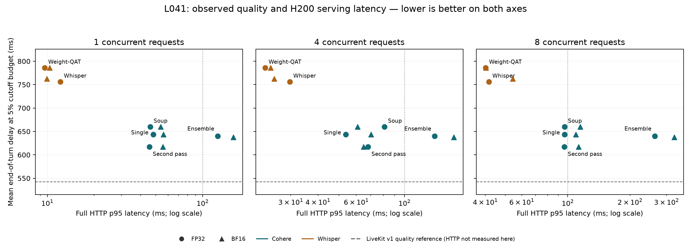
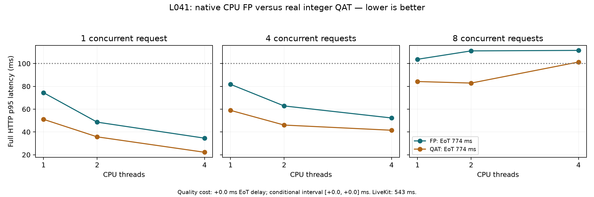
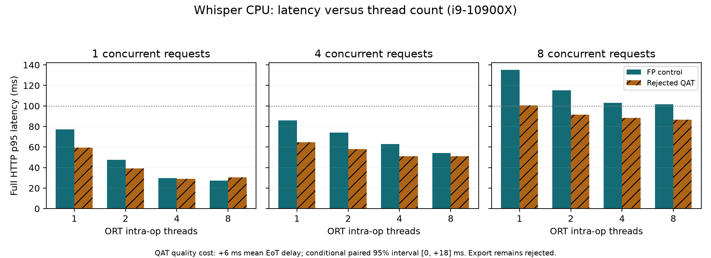

# L041: final-recipe evidence report

Snapshot: 2026-09-07T08:21:25.746199+00:00. **Final closeout by user request; LiveKit target unmet. No further compute is queued.**

L041 combines additional English SmartTurn and AppTek data, Cohere teachers with tail texture, a three-seed logit ensemble, dense distillation targets, a distilled Whisper student, model soups and paired quantization-aware continuations. No artifact has been promoted.

**Closed at 2026-09-07T08:13:25.739154+00:00.** Completed quality results are retained. All 24 unstarted local HTTP configurations were cancelled; no L041 service or local GPU compute process remained at the closure check. The H200 rental was already terminated. Further Krisp evaluation is omitted.

## Final findings

**Whisper QAT is within the registered numerical margin on the native CPU backend.** Its saved artifact has maximum error **0.01287657 <0.02** and executes 36 real INT8 projections. At two threads, full HTTP p95 is **35.69/46.03/82.87 ms** at concurrency 1/4/8, with zero errors; EoT delay remains **774 ms**, matching its FP control. Original ONNX acceptance is still failed.

The best **floating-point L041 teacher** remains Cohere seed 222 at **615 ms**. The final **experimental native INT8 Cohere on RTX 3090, batch 1**, measured **612 ms**. LiveKit v1 is **543 ms**: the latter gap is **+69 ms**, with paired conditional 95% interval **[−26.28, +161.78] ms**. This establishes neither superiority nor equivalence. The INT8 path still fails its original numerical fidelity gate and has no HTTP timing. Development AUC, benchmark EoT delay and HTTP execution latency are distinct metrics.

The exercise requests ideally under 100 ms per request and measurements on the local machine; page 2 does not specify CPU/GPU, a percentile or concurrency. Our additional CPU p95 <100 ms at concurrency 8 gate is stricter and separate. H200 HTTP results below cannot substitute for the requested local measurement.

## What was actually combined and trained

**Terms:** EoT means end of turn; its delay includes the decision policy. QAT means quantization-aware training, which simulates quantization while learning. FP means floating point. LoRA adapts a large encoder with low-rank weight updates. A prediction ensemble runs multiple models and averages outputs; a weight soup averages compatible weights into one model. AUC measures ranking quality; it is not an EoT delay.

- **Data and teachers:** the fixed expanded English data, room tone, 30% telephony augmentation and tail texture were used with the three Cohere LoRA teachers (seeds 111/222/333, rank 16, alpha 32). Each teacher continuation used one pass / 1,127 updates, effective and microbatch 128, encoder/head learning rates 2e-5 / 1e-3, AdamW weight decay 0.01 and 20% warmup. BF16 eager used FP32 master weights and optimizer states, without activation checkpointing.
- **Teacher ensemble and dense coverage:** mean raw logits from the three teachers supervised identical realized causal audio views at temperature 2. Dense eligible training pause prefixes on a 100 ms grid were capped at 16,384 per epoch. Two 160,581-row epochs plus 32,768 continuation rows supplied 353,930 cached targets; no benchmark labels became training targets.
- **Whisper distillation and soup:** three fixed learning-rate trajectories (2e-5, 8e-5, 3.2e-4), batch 1024, 314 updates, cosine schedule, 10% warmup and weight decay 0.01. Selection used the fixed 16,390-row dev set. The selected model was the middle-LR **8e-5 final checkpoint**, not its snapshot soup: dev AUC **0.893461** versus soup **0.893284**. Soup slightly reduced BCE but did not pass the AUC rule. Snapshots were taken at updates 283/298/314.
- **Paired QAT continuations:** matched FP and QAT paths used the same fixed 1,024-update budget, effective batch 32, learning rate 5e-6 and weight decay 0.01; observers collected ranges for 512 updates and were frozen for 512. Alternative quantizers, integer exports and backends are identified separately below. Training used BF16 with the relevant quantized Linear computations in FP32; this was not an FP8 training campaign.
- **Efficiency evidence:** the cached-feature Whisper batch-1024 pilot reached **6,859.68 examples/s**, with **29.14 GiB** reserved. Its operator-count MFU estimate was **17.8%** against a dense H200 BF16 reference; this excludes optimizer/preprocessing FLOPs and is not a hardware-counter measurement or the throughput of the entire campaign. Pilot batches had unequal update counts and establish no quality conclusion.
- **What the combinations established:** more data, texture, ensemble targets and denser/multiple-pass distillation were bundled into L041, so their individual gains cannot be isolated here. The ensemble and soup were tested, not assumed to improve the best member. Earlier L040 augmentation × distillation evidence is kept separately in the program report.

## Fixed data and comparison contract

- Training: 144,197 rows, including 24,571 additional AppTek cuts and 26,077 cuts from 8,000 new English SmartTurn clips. Fixed dev: 16,390 rows. AMI and ICSI excluded.
- Three Cohere teacher seeds: 111, 222 and 333; one additional texture pass per seed. Ensemble targets are the arithmetic mean of raw logits for identical audio views.
- Distillation: two 160,581-row epochs plus a 32,768-row continuation panel, 353,930 cached targets in total. Dense points carry no fabricated hard labels.
- Public reference: 11,191 English validation score points from the pinned LiveKit benchmark, with exact row/timestamp/label alignment. Original harness rules, score point 0.2 s and 5% cutoff budget are unchanged.
- Policy thresholds/delays/timeouts are selected on that same benchmark. Paired 1,000-replicate turn-cluster intervals are conditional descriptive estimates, not blind-test confirmation. The program has repeatedly inspected this benchmark.
- Data audit found no exact expanded-train/benchmark or train/dev overlap. Two brief perceptual similarities remain unresolved; 1,463 short added clips were not amenable to the fingerprint check, and pretraining overlap is not fully auditable. These limits preclude claiming a fully clean blind test.
- **User closeout:** no further training, inference or rental is scheduled. Additional Krisp coverage is omitted; historical evidence is retained without filling missing cells.

## Completed original candidate quality comparisons

These nine candidate readouts use the original public harness. They are separate from the paired integer-backend diagnostics and from the hardware-specific serving matrix. No soup or ensemble is assumed better than its members. All operating points are conditional on policy selection on the same benchmark.

| Candidate | Mean EoT @5% (ms) | Actual cutoff (%) | AUC |
|---|---:|---:|---:|
| Cohere teacher seed 111 | 643.75 | 4.9645 | 0.967801 |
| Cohere teacher seed 222 | 615.00 | 4.8227 | 0.968532 |
| Cohere teacher seed 333 | 636.00 | 4.9645 | 0.967387 |
| Cohere three-teacher ensemble | 640.25 | 4.9645 | 0.968801 |
| Cohere weight soup | 660.00 | 4.9645 | 0.964493 |
| Selected distilled Whisper | 756.25 | 4.9645 | 0.950493 |
| Whisper matched FP continuation | 774.00 | 4.9645 | 0.950996 |
| L040 texture + distillation: three-Whisper ensemble | 803.50 | 4.8227 | 0.948089 |
| L040 texture + distillation: Whisper weight soup | 1212.50 | 4.9645 | 0.832610 |

The machine-readable inventory also preserves all **33 central public-analysis summaries**, their exact operating points, AUC/AP and paired LiveKit contrasts. Floating fake-QAT reference scores, rejected exports and actual integer backends retain separate identities.

## Cloud serving configurations — NVIDIA H200

**Every HTTP latency in this table was measured on the rented NVIDIA H200, not the local RTX 3090. RTX 3090 full-HTTP latency for these exact final configurations was not measured before closure.** Mean EoT delay is a benchmark decision-wait metric; it is not model execution time or HTTP response time.

Quality and latency below identify the same checkpoint and serving engine. Full HTTP includes the original audio frontend; measurements use one training-clip payload, 400 requests per concurrency, no geographic network latency, and exclude startup. These observations do not establish general deployment capacity.

| Candidate | HTTP hardware | Precision | Mean EoT delay @5% (ms) | HTTP p95 c1 / c4 / c8 (ms) | Errors |
|---|---|---|---:|---:|---:|
| Cohere 3-seed ensemble | NVIDIA H200 | BF16 | 637.50 | 157.7 / 168.4 / 326.7 | 0 |
| Cohere 3-seed ensemble | NVIDIA H200 | FP32 | 640.25 | 125.0 / 137.5 / 263.3 | 0 |
| Cohere second texture pass | NVIDIA H200 | BF16 | 617.00 | 55.5 / 64.9 / 112.9 | 0 |
| Cohere second texture pass | NVIDIA H200 | FP32 | 617.00 | 45.4 / 68.0 / 96.4 | 0 |
| Cohere single seed | NVIDIA H200 | BF16 | 643.75 | 56.1 / 70.1 / 109.3 | 0 |
| Cohere single seed | NVIDIA H200 | FP32 | 643.75 | 48.0 / 53.7 / 96.6 | 0 |
| Cohere weight soup | NVIDIA H200 | BF16 | 660.00 | 53.8 / 60.9 / 114.8 | 0 |
| Cohere weight soup | NVIDIA H200 | FP32 | 660.00 | 46.0 / 81.0 / 96.5 | 0 |
| Distilled Whisper | NVIDIA H200 | BF16 | 762.50 | 10.0 / 25.2 / 54.2 | 0 |
| Distilled Whisper | NVIDIA H200 | FP32 | 756.25 | 12.2 / 29.7 / 41.6 | 0 |
| Whisper weight-QAT (floating-point engine) | NVIDIA H200 | BF16 | 786.00 | 10.4 / 24.3 / 40.3 | 0 |
| Whisper weight-QAT (floating-point engine) | NVIDIA H200 | FP32 | 786.00 | 9.6 / 22.9 / 40.1 | 0 |

The figure is a descriptive comparison of observed points, not a statistically established Pareto frontier. The horizontal LiveKit line has no corresponding HTTP measurement in this experiment. No CPU point is mixed into the H200 plot.

## Local RTX 3090 and CPU serving matrix

Registered **18** fixed measurements: 12 RTX 3090 configurations (FP32/BF16) and six CPU FP32 configurations. Checkpoints and the exact HTTP payload match their H200 receipts. Each requires the original 34-input training/synthetic batch-parity check before 400 HTTP requests at concurrency 1/4/8. **0 outcomes recorded; all 18 cancelled before HTTP measurement by user request.**

## Original ONNX quantization: numerical acceptance failed

The original Whisper QAT export failed its frozen 97-input panel (maximum probability error 0.10845 >0.02). Cohere QAT also failed (0.05464 >0.02), despite verified integer execution. Removing output fake quantization in a newly trained Whisper variant still failed (0.04933); constraining scales to powers of two during a separate new continuation failed (0.05328). None is an accepted deployment artifact.

A tested reciprocal-rounding export representation matches isolated PyTorch quantization ties and executes real integer Linear operators, but did not resolve full-model acceptance. Integer node counts alone do not establish numerical parity or benchmark quality.

The registered alternative is weight-only QAT with runtime dynamic U8 activation quantization. This is not full W8A8 QAT: weights are trained through fake quantization; activation quantization is introduced at serving and its error is measured separately. It must pass the original 0.02 probability tolerance on all 97 frozen inputs in both batch 8 and batch 1, plus a 0.02 batch-consistency gate. The global dynamic export failed (0.11953 probability error; 0.09752 batch dependence). Per-vector symmetric and asymmetric exports removed batch dependence but still failed the probability gate (0.02350 and 0.02612). Their floating-point GPU engines use materialized trained quantized weights and do not execute INT8 kernels. The final registered continuation trained the same per-vector symmetric activation quantizer lowered to integer serving. It also failed the original gate (0.0219638 >0.02; batch difference <2e-7). Actual FP/INT8 public quality and CPU HTTP are diagnostic measurements; none reverses this rejection.

## Verified native CPU QAT: quality, latency and size

The final per-vector QAT checkpoint also has a separate TorchScript CPU serving artifact. Its 36 learned Linear projections execute signed INT8 products with INT32 accumulation; convolution, attention and other remaining operations stay floating point. This is real integer execution from a QAT-trained model, with no additional training. It does not convert the rejected ONNX artifact into an accepted one or establish GPU INT8 performance.

The saved and reloaded QAT artifact passed all **97 frozen training-derived inputs** at batch 8 and batch 1, with maximum probability error **0.01287657 <0.02**. Serialization added zero observed error; batch dependence was below 1.2e-7. The loaded graph and CPU execution trace each contain **36 integer operations**. The matched FP artifact had zero observed reference error. No tolerance was relaxed.

Both saved artifacts scored the same **11,191 public points** using the unchanged frontend and harness: FP/QAT mean EoT delay at the 5% cutoff budget is **774/774 ms**. The conditional paired difference is **+0.00 ms**, with 95% interval **[0.00, 0.00] ms** at each model’s benchmark-selected policy. This matches one operating-point metric; it does not mean identical scores or blind-test equivalence.

AUC FP/QAT is **0.950996/0.950848**; AP is **0.900987/0.899924**. Thresholds are 0.17/0.18. With the FP policy fixed, QAT changes EoT delay by **-6.00 ms** but raises cutoff to **5.248%**, outside the 5% budget. LiveKit remains at **543 ms**, so the native QAT model does not beat it.

Full loopback HTTP uses the original audio frontend/API on the same i9-10900X CPU, 400 requests per concurrency, maximum eight in flight and no competing scientific workload. One/two-thread configurations each passed all 97 probes against four threads before measurement. Results are single observed runs with one fixed training-audio payload, not deployment capacity guarantees.

| Artifact | CPU threads | HTTP p95 c1 / c4 / c8 (ms) | Errors |
|---|---:|---:|---:|
| FP | 1 | 74.45 / 81.77 / 103.73 | 0 |
| FP | 2 | 48.59 / 62.80 / 111.10 | 0 |
| FP | 4 | 34.55 / 52.26 / 111.52 | 0 |
| QAT | 1 | 51.06 / 58.94 / 84.23 | 0 |
| QAT | 2 | 35.69 / 46.03 / 82.87 | 0 |
| QAT | 4 | 22.18 / 41.49 / 101.34 | 0 |

At the same **two-thread** setting and concurrency eight, p95 falls from **111.10 to 82.87 ms (25.4% lower)**. QAT meets the additional p95 <100 ms / zero-error gate for all three measured concurrency levels at two threads. Four threads is faster for low concurrency; two is fastest observed at concurrency eight. These choices use latency only, not public quality.

Serialized artifacts occupy **77.22 MiB FP** and **23.39 MiB QAT**, a **69.7% reduction**. These are file sizes, not peak process memory.

The original ONNX results below retain their separate engine identity and rejection. The native artifact is an experimental CPU path tied to PyTorch 2.14.0; the numerical panel is not a proof over all possible audio. No production source or incumbent model was replaced.

[Detailed native CPU addendum](NATIVE_CPU.md) · Artifact and measurement hashes (separate research archive: `output/L041/native_cpu_inventory.json`)

## Final interpretation

The 31 remote stages, recovery, original nine-candidate public/accent/panel queue, paired native CPU quality analysis and both four-run practical GPU FP/QAT studies are complete. The user ended experimentation before the remaining local HTTP matrix. The original ONNX QAT export failed; the separate native Whisper CPU artifact passed its numerical panel and has measured quality and HTTP latency. These are final research findings with explicit coverage limits, not a production or state-of-the-art claim.

W&B receives aggregate metrics only. Local receipts and source hashes remain authoritative. The protected incumbent ONNX, evaluation harness, labels, splits and production source are unchanged.

## Historical three-Whisper ensemble: measured CPU cost

The registered B11 three-seed prediction ensemble executes all three Whisper models and averages their raw logits. On the i9-10900X, four CPU threads and the same HTTP frontend, its p95 at concurrency 1/4/8 is **82.58 / 161.42 / 346.33 ms**, with **0 errors** over 400 requests per level. It meets the 100 ms p95 reference only at concurrency one. These are actual three-forward timings, not the cost of one member or a weight soup.

All 97 frozen training-derived probes passed batch 1 versus batch 8 with maximum difference **3.58e-07**; each of the three members executed 110 calls. This completes the missing CPU HTTP measurement. Its historical public/accent readouts remain separate; public-dev/heldout panel and internal-frontier analysis is now complete and reported below. No public quality inference or training was repeated for this timing measurement.

## Additional native FP/QAT accent evidence

The same saved native CPU FP/QAT artifacts have now completed the accent stages listed below. These are point estimates from completed, hash-verified scoring receipts; paired confidence intervals and completed panel/frontier analysis are reported below. No training or threshold tuning was performed for this readout.

- **Room-tone-filled accents (13,086 cuts):** AUC FP **0.760619**, QAT **0.760217**; QAT minus FP **-0.000401**.
- **Raw accents (13,086 cuts):** AUC FP **0.772458**, QAT **0.772046**; QAT minus FP **-0.000412**.

These accent AUC results do not measure end-of-turn delay and do not establish a win over LiveKit or statistical equivalence between FP and QAT.

## Completed Cohere/Whisper accent and internal-policy analysis

These candidates have complete, verified scoring and aggregate receipts. The unchanged L007 panel measures discrimination at 200 ms into a pause; the internal AppTek frontier measures mean wait at a 5% false-cutoff budget using the original strict turn construction. Each uses 1,000 clip/conversation bootstrap draws. Internal wait is not the public LiveKit benchmark metric and must not be compared directly with its 543 ms reference. Public-dev panels are in-sample for the r3 recipe and are retained as diagnostics only.

| Candidate | Accent AUC filled / raw | Heldout TPR at 5% FPR, 200 ms | Internal wait at 5% cutoff (ms), 95% CI |
|---|---:|---:|---:|
| Cohere three-seed logit ensemble | 0.8320 / 0.8420 | 0.3333 | 1716.4 [1461.1, 1947.6] |
| Cohere seed 111 | 0.8259 / 0.8375 | 0.3196 | 1684.5 [1445.3, 1922.2] |
| Cohere seed 222 | 0.8298 / 0.8397 | 0.3260 | 1662.8 [1449.4, 1924.5] |
| Cohere seed 333 | 0.8327 / 0.8421 | 0.3390 | 1678.1 [1451.5, 1987.8] |
| Cohere weight soup | 0.8168 / 0.8261 | 0.2939 | 1832.5 [1458.0, 1943.4] |
| Historical B11 three-Whisper logit ensemble | 0.7544 / 0.7621 | 0.1983 | 1857.6 [1483.6, 1978.2] |
| Historical B11 Whisper weight soup | 0.6684 / 0.6601 | 0.1413 | 1869.3 [1495.5, 1994.0] |
| Whisper matched FP continuation | 0.7606 / 0.7725 | 0.2056 | 1774.5 [1468.9, 1984.8] |
| Selected distilled Whisper | 0.7624 / 0.7738 | 0.2139 | 1789.3 [1470.9, 1965.9] |

These descriptive readouts do not select or retrain a candidate. Replay checks against the original policy implementation passed for each reported frontier.

## Completed paired native FP/QAT quality analysis

Both exact saved CPU artifacts have now completed accents, L007 panels and the internal frontier. Differences below are QAT minus FP, using 1,000 shared clip/conversation bootstrap draws and unchanged metric helpers. Public-dev results are in-sample; these intervals do not establish a blind-test or LiveKit win.

- **Room-tone-filled accent AUC:** difference -0.000401, 95% CI [-0.000805, 0.000028].
- **Raw accent AUC:** difference -0.000412, 95% CI [-0.000795, -0.000009].
- **Heldout TPR at 5% FPR, 200 ms:** difference 0.0014, 95% CI [-0.0061, 0.0049]; 1000/1000 finite draws.
- **Internal mean wait at 5% cutoff (ms):** difference 4.0362, 95% CI [-34.0301, 53.3455]; 1000/1000 finite draws.

The internal frontier and public benchmark measure different cohorts and operating rules. Completed scoring does not imply statistical equivalence or production acceptance.

## Cohere QAT: separate native CPU diagnosis

The completed fixed 34-input training/synthetic check also **fails** on the separate native CPU path: maximum QAT-reference versus integer probability error **0.05031040**, against the unchanged **0.02** tolerance. Profiling verifies **384** real INT8 projections. Input/output quantizers and effective LoRA weights are preserved; no training, calibration or public-model selection was performed.

Batch 1 versus batch 8 differs by **0.05900073** on the integer path and **0.04584935** on the floating fake-quantized reference itself. Both exceed the numerical margin. This establishes batch-sensitive numerical behavior in the reference too; it does not identify a single root cause. An explanation limited to ONNX conversion is insufficient. This CPU Cohere artifact has no accepted integer serving result or CPU integer quality/HTTP measurement. The separate RTX 3090 practical quality readout is reported below. The accepted native Whisper result is separate.

The 0.02 gate measures conversion fidelity, not task-quality loss. A maximum probability difference near 0.05 is not a 5% loss of EoT quality. The practical GPU FP/QAT quality readout is complete below; its HTTP comparison was cancelled at closure. End-to-end serving acceptability remains unestablished. The original numerical rejection remains recorded; it is not sufficient by itself to discard the candidate for every use case.

## Cohere QAT on the local RTX 3090

The native GPU diagnostic verifies **384 CUDA INT8 projections** and **16 exact integer checks** against independent CPU INT64 dot products. Maximum probability error versus its GPU fake-quantized reference is **0.07309070**, mean **0.01050426**. The original **0.02** fidelity gate remains **failed**. Integer batch1/8 discrepancy is **0.05287039**; the reference itself differs by **0.08120215**. These are RTX 3090 observations, not H200 results or HTTP timings.

A separate CPU operator diagnosis used four frozen training/synthetic inputs and compared float versus integer projections on exactly identical incoming tensors. **287/384 projections** exhibit output changes: **1,036/350,945,280 activation elements** across the diagnostic calls. Maximum difference before output quantization is **0.00061035**; after quantization it reaches **1.12853622** in a hidden activation, not a probability. The largest jump matches one output quantization step. This directly demonstrates amplification at quantization boundaries; it is not a benchmark quality result or proof that every discrepancy has the same cause.

The practical study retains this rejection and evaluates the fixed matched FP/QAT pair on all 11,191 original public benchmark points at **batch 8 and batch 1**. It reports each model’s original benchmark-selected policy, QAT under the frozen FP policy, and batch sensitivity under the batch-one policy. No training, quantizer adjustment, model selection or Krisp scoring is performed. Statistics remain conditional on the repeatedly inspected benchmark.

- **FP, batch 8:** EoT wait **636.00 ms**, cutoff rate **4.965%**, AUC **0.967472**.
- **QAT, batch 8:** EoT wait **627.50 ms**, cutoff rate **4.965%**, AUC **0.968252**.
- **FP, batch 1:** EoT wait **636.00 ms**, cutoff rate **4.965%**, AUC **0.967472**.
- **QAT, batch 1:** EoT wait **612.00 ms**, cutoff rate **4.965%**, AUC **0.968486**.

The Cohere practical study is complete: four FP/QAT runs, each covering all 11,191 public points at its registered batch size. Full HTTP was cancelled before measurement.

- **QAT minus FP, batch 8, each own selected policy:** EoT difference **-8.50 ms**, paired 95% interval **[-57.50, +35.01] ms**; QAT cutoff rate **4.965%**.
- **QAT minus FP, batch 8, qat with frozen fp policy:** EoT difference **+16.00 ms**, paired 95% interval **[-32.00, +64.00] ms**; QAT cutoff rate **4.823%**.
- **QAT minus FP, batch 1, each own selected policy:** EoT difference **-24.00 ms**, paired 95% interval **[-64.00, +16.00] ms**; QAT cutoff rate **4.965%**.
- **QAT minus FP, batch 1, qat with frozen fp policy:** EoT difference **+8.00 ms**, paired 95% interval **[-24.00, +40.00] ms**; QAT cutoff rate **4.823%**.

## Completed coverage and intentionally unmeasured items

- **LiveKit target:** unmet. Best floating-point teacher 615 ms; experimental batch-one native INT8 diagnostic 612 ms; LiveKit 543 ms. No deployment promotion.
- **Original deployment contract:** the QDQ ONNX QAT export has not passed its frozen numerical gate. The verified native CPU backend is additional evidence, not a silent replacement of that contract.
- **Final local HTTP:** all 18 original matrix configurations (12 RTX 3090, six CPU), two Cohere eager, two Cohere graph and two Whisper graph configurations were cancelled before measurement. Completed GPU quality and graph replay checks are preserved; neither is an HTTP latency result. Historical Cohere CPU and L041 H200 timings retain their exact model/backend identity.
- **Historical three-Whisper B11 ensemble:** CPU HTTP, historical public and accent readouts are available; public-dev/heldout panels and the internal frontier are complete.
- **Final native FP/QAT pair:** the 11,191-point public comparison and CPU HTTP are complete; accents, L007 panels and internal-frontier analysis for these exact artifacts are now complete and reported above.
- **User closeout:** no further training, inference or rental is scheduled. Additional Krisp coverage is omitted; historical evidence is retained without filling missing cells.
- **Data and generalization:** unresolved provenance limitations and repeated benchmark use still prevent a clean blind-test claim.

## Completed local evaluation queues

Final preserved status files captured at 2026-09-07T08:21:25.746199+00:00; both quality queues are complete; they do not add HTTP measurements.

- **Public Cohere/Whisper queue:** all nine candidates and their aggregate analyses are complete.
- **Native FP/QAT pair:** COMPLETE; inference and paired quality analysis have finished.

Both quality queues exclude Krisp. HTTP timings reported above were collected separately; no inference-latency measurements should overlap these quality workloads.

## Cohere CUDA Graph execution optimization

This serving experiment preserves trained weights, learned quantizer scales and the deterministic frontend noise. It removes frozen observer-flag host checks, caches the original CPU-generated dither on GPU and resolves the fixed-window output length before capture. Capture uses a separate graph for each actual batch size 1–8; no real requests are padded into another batch size. The independent 1e-6 optimization check does not relax the failed 0.02 fake-QAT-to-integer conversion gate. Only explicit HTTP receipts below establish measured latency.

- **FP:** all eight actual batch sizes checked on 34 fixed training/synthetic inputs; execution fidelity **passed** at **1e-06**. Maximum eager preparation error **0**; captured versus prepared-eager error **0**. Integer kernels per captured forward: **0**. This is not an HTTP timing.
- **FP serving-engine startup:** all eight graphs resident simultaneously; full training-probe replay passed with maximum error **0**. Peak PyTorch GPU allocation during this initialization/replay was **7.59 GiB**. This verifies startup and graph coexistence, not latency or total device-memory use.
- **QAT:** all eight actual batch sizes checked on 34 fixed training/synthetic inputs; execution fidelity **passed** at **1e-06**. Maximum eager preparation error **0**; captured versus prepared-eager error **0**. Integer kernels per captured forward: **384**. This is not an HTTP timing.
- **QAT serving-engine startup:** all eight graphs resident simultaneously; full training-probe replay passed with maximum error **0**. Peak PyTorch GPU allocation during this initialization/replay was **3.07 GiB**. This verifies startup and graph coexistence, not latency or total device-memory use.

## Final Whisper QAT on RTX 3090: true integer execution

The same trained per-vector QAT checkpoint was tested with **36 real CUDA INT8 kernels**, verified against four independent INT64 dot-product cases. The first saved TorchScript GPU artifact is **rejected**: maximum probability-output error versus its GPU reference **0.02140123**, saved-runtime versus eager error **0.02886432**, and CPU/GPU error **0.03760338**. The frozen panel contains 97 training/synthetic probes; no re-training or recalibration occurred.

Disabling JIT executor optimizations for the same saved artifact reduced but did not remove the mismatch: reference error **0.01662698**, saved-runtime/eager error **0.01446289**, CPU/GPU error **0.02682123**. That execution mode also remains rejected. This observation does not establish that fusion explains every difference.

- **Direct FP with CUDA Graphs:** all actual batches 1–8 checked on the same 97 probes; `p_eot` graph/eager error **0.00000000**, GPU-reference error **0.00000000**, CPU-backend error **0.00000292**, batch-versus-one error **0.00000215**; **0 INT8 kernels** per captured forward.
- **Direct QAT with CUDA Graphs:** all actual batches 1–8 checked on the same 97 probes; `p_eot` graph/eager error **0.00000000**, GPU-reference error **0.01917583**, CPU-backend error **0.02491221**, batch-versus-one error **0.01705843**; **36 INT8 kernels** per captured forward.

The direct QAT GPU-reference error is below 0.02 and graph replay adds zero observed error. Its cross-CPU error of 0.024912 still fails the separately retained 0.02 margin. Following the user’s request to assess practical acceptability near 0.05, this exact direct backend was assessed experimentally for EoT quality; its HTTP comparison was cancelled at closure. It does not accept either failed TorchScript GPU path or replace the accepted CPU artifact.

- **GPU FP, batch 8:** EoT wait **774.00 ms**, cutoff **4.965%**, AUC **0.950996**.
- **GPU QAT, batch 8:** EoT wait **774.00 ms**, cutoff **4.965%**, AUC **0.950791**.
- **QAT−FP, batch 8, each own selected policy:** **-0.00 ms**, paired conditional 95% CI **[+0.00, +0.00] ms**; QAT cutoff **4.965%**.
- **QAT−FP, batch 8, qat with frozen fp policy:** **-6.00 ms**, paired conditional 95% CI **[-24.00, +0.00] ms**; QAT cutoff **5.390%**.
- **GPU FP, batch 1:** EoT wait **774.00 ms**, cutoff **4.965%**, AUC **0.950996**.
- **GPU QAT, batch 1:** EoT wait **780.50 ms**, cutoff **4.965%**, AUC **0.950862**.
- **QAT−FP, batch 1, each own selected policy:** **+6.50 ms**, paired conditional 95% CI **[-41.25, +49.01] ms**; QAT cutoff **4.965%**.
- **QAT−FP, batch 1, qat with frozen fp policy:** **-6.00 ms**, paired conditional 95% CI **[-24.00, +0.00] ms**; QAT cutoff **5.390%**.

All public comparisons use the same 11,191 original benchmark points and the unchanged harness. Policies are selected on that same repeatedly inspected benchmark; an identical EoT point estimate does not establish general statistical equivalence. The fixed-FP-policy cutoff must independently meet the 5% budget.

Full HTTP for the final Whisper GPU integer pair was cancelled before measurement. No inference speedup is inferred from quality-scoring wall time.

## Batch sensitivity and final practical interpretation

- **Cohere native GPU QAT, batch 8 under the frozen batch-one policy:** EoT **628.00 ms**, change **+16.00 ms**, conditional 95% CI **[+0.00, +40.00] ms**, cutoff **5.1064%**.
- **Whisper native GPU QAT, batch 8 under the frozen batch-one policy:** EoT **780.50 ms**, change **+0.00 ms**, conditional 95% CI **[+0.00, +0.00] ms**, cutoff **4.9645%**.

Cohere crosses the 5% cutoff budget when the batch-one policy is reused at batch eight. Whisper retains the batch-one operating point; its separately selected batch-eight policy gives a different delay. Numerical batch sensitivity and policy selection therefore remain visible instead of collapsing both batches into one headline.

**Practical decision:** the native Whisper CPU INT8 artifact is the strongest completed QAT serving result: 774 ms public EoT and 82.87 ms HTTP p95 at concurrency eight / two CPU threads, versus 111.10 ms for matched FP. This is a 25.4% p95 reduction and a 69.7% serialized-size reduction, with a small measured raw-accent AUC loss. At the original four-thread setting, QAT p95 is 101.34 ms at concurrency eight; the strict four-thread gate is not retrospectively passed. The two-thread configuration is a measured serving optimization. Cohere offers lower observed EoT delay, but final local GPU/CPU HTTP remains unmeasured. The shipped incumbent is unchanged.

A maximum probability discrepancy of 0.05 is a fidelity tolerance, not a 5% quality loss. The user allowed practical diagnostics around that scale; all original 0.02 acceptance verdicts remain intact. No numerical tolerance alone establishes acceptable task quality, latency or production readiness.

## Reproduction and sources

- [Final closure receipt](CLOSEOUT.json) records completed quality studies, cancelled HTTP configurations and the compute stop. The historical protocol JSON is frozen by SHA; current status belongs to this receipt and STATE/PROGRAM, not a rewritten training contract.
- Machine-readable evidence inventory (separate research archive: `output/L041/evidence_inventory.json`) binds each quality and HTTP receipt by SHA-256 (archived with the research tree).
- Full program report (separate research archive: `output/FINAL_REPORT.md`) preserves earlier experiments and historical CPU measurements.
- L041 protocol (separate research archive: `research/labeling/experiments/L041.json`), the campaign runner and the complete research program (L001-L041) are retained in the separate research archive; this report was rendered by its `reporting/build_report.py`.

## Original ONNX FP / integer-QAT diagnostic

The matched FP and trained per-vector QAT models were evaluated using actual ONNX Runtime CPU graphs on all 11,191 public points. Both used the original normalized audio frontend, batch 8, four ORT threads and EXTENDED graph optimization. The QAT graph remains rejected for deployment (export error 0.0219638 >0.02). Its 36 integer projections each executed all 110 export-check calls.

With each model’s benchmark-selected policy, QAT changes mean EoT delay by **+6.00 ms** relative to FP; conditional paired 95% interval **[+0.00, +18.00] ms**. Holding the FP policy fixed instead gives **-6.00 ms**, with cutoff-rate change **+0.426 percentage points**. These are descriptive diagnostics, not blind validation or acceptance.

Full HTTP on the same local CPU uses the exact same frontend/API and EXTENDED runtime settings for both models, 400 requests at each concurrency. Only the experimental loopback service can exercise the rejected QAT artifact; the production acceptance guard is unchanged.

| Concurrency | FP p95 (ms) | Rejected QAT p95 (ms) | FP / QAT speed ratio | FP / QAT errors |
|---:|---:|---:|---:|---:|
| 1 | 29.64 | 29.21 | 1.015× | 0 / 0 |
| 4 | 62.89 | 50.90 | 1.235× | 0 / 0 |
| 8 | 102.90 | 88.45 | 1.163× | 0 / 0 |

CPU and H200 timings are separate hardware-specific observations. A faster rejected model does not satisfy the deployment gate.

## Original ONNX CPU thread-count optimization

A serving-only sweep compared one, two and four ORT intra-op threads on the same local i9-10900X CPU, followed by one registered eight-thread check because four threads remained faster than one/two for FP. The completed four-thread runs were reused. Each new setting passed the same 97 frozen training-derived numerical checks against four threads with a 1e-6 probability tolerance before HTTP measurement. These are single observed runs, not a confidence interval for deployment capacity. QAT remains rejected for deployment.

| Model | ORT threads | HTTP p95 c1 / c4 / c8 (ms) | Errors |
|---|---:|---:|---:|
| Matched FP | 1 | 77.19 / 85.81 / 135.31 | 0 |
| Matched FP | 2 | 47.54 / 74.13 / 115.25 | 0 |
| Matched FP | 4 | 29.64 / 62.89 / 102.90 | 0 |
| Matched FP | 8 | 27.43 / 54.13 / 101.62 | 0 |
| Rejected QAT diagnostic | 1 | 59.32 / 64.70 / 100.66 | 0 |
| Rejected QAT diagnostic | 2 | 39.21 / 58.15 / 91.51 | 0 |
| Rejected QAT diagnostic | 4 | 29.21 / 50.90 / 88.45 | 0 |
| Rejected QAT diagnostic | 8 | 30.51 / 50.89 / 86.70 | 0 |

The fastest observed configuration at concurrency 8 is selected only for runtime configuration. It does not select or retrain a model using public quality results.

## Recovery, rental and closure

Remote SHA before recovery, local SHA verification and remote SHA after recovery agreed for **1,977 files (49.61 GB)**. Lium listed **0 remaining pods** at 2026-09-07T03:45:03.680048+00:00. Rental cost estimated from request through deletion was **$16.43**, with **$3.57** account balance after termination. This is the recorded estimate, not a separately audited invoice.

No model was promoted. Cohere seed 222 remains the best floating teacher at 615 ms; the final experimental native INT8 batch-one diagnostic is 612 ms. The fully measured second-pass Cohere H200 serving candidate is 617 ms. LiveKit remains 543 ms. Original ONNX QAT acceptance failed; separate native CPU acceptance and measured quality/latency are reported above. The user closed the campaign with all remaining local HTTP work cancelled.

## Aggregate tracking

W&B readback verified **43/43 aggregate records**, including both native CPU candidates and all measured thread configurations. Audio, individual predictions and private identifiers are excluded. The central synchronizer has no L041 `results/` directory and reports zero; the experiment-specific aggregate sync and readback provide the tracking evidence.
