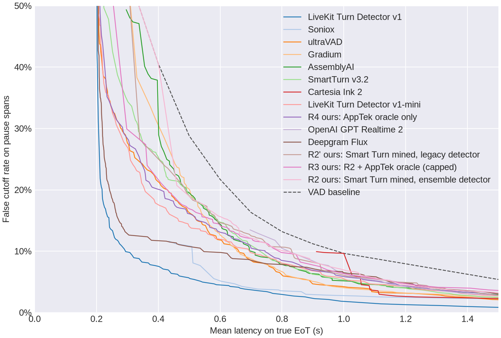

# Notas para la defensa: pipeline de etiquetado y resultados (5 sep 2026)

Documentos relacionados: `LABELING_PIPELINE_PLAN.md` (lo que se propuso, con umbrales a priori),
`EXECUTION_LOG.md` (lo que pasó al ejecutarlo, en orden), `RESULTS_SUMMARY.md` (tablas generadas por
`eot-report summarize`), `figures/` (gráficas del harness oficial). Todo lo de aquí sale de ficheros en
`eval/` y `data/mined/*/metadata.json|report.json`.

## 1. En una página

**Qué se construyó.** Un pipeline de etiquetado para end-of-turn con tres fuentes y tres tests, todo
pinneado por revisión y validado con números antes de entrenar:

- *Detector de pausas ensemble* (energía adaptativa al suelo de ruido + Silero VAD v6.2.1, con confianza
  por pausa) que sustituye al umbral fijo relativo al pico. Motivo medido: el detector antiguo encuentra
  **0.0 pausas por clip** a 20 dB de SNR telefónica (Jaccard limpio-vs-ruido 0.00); el ensemble mantiene
  Jaccard 0.82 y no infla pausas (2.46 → 2.76 por clip).
- *Minado de prefijos* de Smart Turn v3.2 (16k clips EN) con ese detector: 55,504 muestras a nivel de
  pausa con metadatos de confianza, SNR estimada y tiempo hasta el siguiente onset.
- *Oráculo dual-channel* sobre AppTek Call-Center (873 llamadas reales, 14 acentos): la etiqueta de cada
  pausa del cliente es **lo que hizo el agente humano** (entrar → EOT; esperar → HOLD), con exclusiones
  contadas (solape, colisión, backchannel, chatter técnico del role-play). 82,488 muestras de train en
  11 acentos y 29,732 held-out en 3 acentos nunca vistos.
- *Tres tests externos*: LiveKit EoT Bench EN con el harness oficial (400 turnos, 1,250 decisiones,
  mismos artefactos publicados de 11 sistemas comerciales), Krisp Turn-Taking Test v1 (2,730 clips, 30
  hablantes, solo test por licencia) y el held-out de AppTek (relleno de room tone vs silencio digital).
- *QA del etiquetador* con umbrales fijados antes de ver datos: fronteras manuales, robustez PSTN,
  regla mono-canal vs oráculo, escucha ciega (preparada, pendiente de humano), distribución.

**Qué salió.** Cuatro runs pre-registradas, misma receta (whisper-tiny fine-tuning completo, 3 épocas,
batch 32, lr 5e-5, semilla 0, audio-only, ventana 8 s), ~3–12 min cada una en una RTX 3090:

| Run | Train | EoT Bench: delay @5 % FC [IC95 bootstrap por turno] | @10 % FC | AUC | Krisp AUC | Krisp delay @5 % FC | AppTek held-out AUC |
|---|---|---|---|---|---|---|---|
| Smart Turn v3.2 público (referencia) | 270k clips, 23 idiomas | **1051 ms** [961–1131] | 739 ms | 0.845 | 0.896 | 614 ms | — |
| R2 minado ensemble | 55.5k | 1190 ms [1134–1247] | 825 ms | 0.849 | 0.855 | 780 ms | 0.668 |
| R2' minado legacy | 35.2k | 1175 ms [1141–1208] | 840 ms | 0.852 | 0.849 | 780 ms | 0.653 |
| R3 = R2 + AppTek (cap 55.5k) | 111k | 1184 ms [1135–1231] | 798 ms | 0.866 | 0.875 | 673 ms | **0.719** |
| **R4 AppTek oráculo solo** | 55.5k | 1122 ms [1077–1181] | **746 ms** | **0.882** | **0.904** | **581 ms** | 0.701 |

Referencias del harness en la misma tabla: LiveKit v1 543 ms, ultraVAD 899 ms, LiveKit mini 1070 ms,
AssemblyAI 1049 ms, GPT Realtime 2 1143 ms, Deepgram Flux 1151 ms, VAD 1600 ms (@5 % FC).

Diferencias emparejadas (mismos turnos remuestreados, cada modelo con su política congelada, 500 reps):

| Comparación | Δ delay @5 % FC | Δ delay @10 % FC | Lectura |
|---|---|---|---|
| R2 vs R2' (ensemble vs legacy) | +15 ms [−38, +69] | −15 ms [−44, +14] | **sin diferencia** |
| R3 vs R2 (añadir AppTek) | −4 ms [−65, +51] | −27 ms [−57, +3] | tendencia, no significativa |
| R4 vs R2 (AppTek en vez de Smart Turn) | −65 ms [−136, +6] | **−80 ms [−109, −53]** | AppTek gana |
| R4 vs Smart Turn v3.2 público | +74 ms [−25, +179] | +5 ms [−24, +32] | **indistinguibles** |
| R2 vs Smart Turn v3.2 público | +139 ms [+50, +224] | +85 ms [+58, +112] | Smart Turn gana |

**Las tres frases que defiendo:**

1. *El detector ensemble arregla un fallo real del etiquetador (colapso total con ruido) y produce un 57 %
   más de muestras, pero no mueve el test.* R2 y R2' son estadísticamente iguales en EoT Bench, Krisp y
   held-out. El cuello de botella no era la precisión de la pausa: era la fuente de datos.
2. *Las etiquetas del oráculo dual-channel sobre 873 llamadas reales valen tanto como el modelo público
   entrenado con 270k clips.* R4 empata con Smart Turn v3.2 en EoT Bench (IC de la diferencia cruza cero
   en ambos budgets), lo supera en Krisp (AUC 0.904 vs 0.896; 581 vs 614 ms) y con nuestra misma receta
   supera claramente al minado de Smart Turn (−80 ms @10 % FC).
3. *El modelo no aprende el atajo del silencio digital.* AUC crudo − relleno en held-out: −0.007 (R2),
   −0.033 (R3), +0.009 (R4). El relleno con room tone en train hace su trabajo.

## 2. Lo que se pre-registró y cómo salió

| Check / umbral a priori | Resultado | Pasa |
|---|---|---|
| Ninguna fuente > 50 % de los **clips** de Smart Turn | liva_1 47.1 % | sí |
| Ninguna fuente > 50 % de las **muestras** minadas | liva_1 **59 %** (sus clips generan más pausas) | **no** → se declara, no se remuestrea |
| ≤ 40 % de clips sin pausa interna | 48 % | **no** → se declara |
| Fronteras AppTek: recall@100 ms ≥ 0.9, error mediano ≤ 60 ms | recall@100 0.67, @200 0.80; error mediano **40 ms** | **no** (ver §3) |
| PSTN: Jaccard mediano ≥ 0.8 a 20 dB | legacy 0.00 · energía 0.84 · ensemble **0.82** | ensemble sí, legacy no |
| Detector final = el que pase PSTN sin inflar pausas | ensemble | decidido antes de entrenar |
| Cap de AppTek en R3/R4 = tamaño del minado ensemble | 55,504 (estratificado por etiqueta, semilla 0) | decidido antes de ver test |
| Escucha ciega humana (175 wav, clave sellada) | preparada en `eval/labeling_qa/listening_audit/` | **pendiente** |

Los tres "no" se reportan tal cual. Ninguno se corrigió a posteriori porque hacerlo invalidaría el
pre-registro; los tres se explican en §3.

## 3. Preguntas incómodas (y respuestas con número)

**"El recall de fronteras es 0.80, no 0.90. ¿El detector se pierde el 20 % de las pausas?"**
No. De los 5,392 huecos manuales sin pausa detectada a ±200 ms: 2,452 (45 %) tienen el fin manual del
segmento *dentro* de una pausa detectada, es decir, el anotador alargó el segmento y el detector puso el
inicio de pausa antes (el error mediano de las emparejadas es 40 ms, así que el detector es el preciso);
1,311 (24 %) tienen una pausa marcada *low* por el veto del VAD; solo 1,629 (6 % del total) no tienen
pausa. "Detector ve la frontera" = 94 %. El umbral estaba mal planteado: mide acuerdo con un anotador
que rellena, no precisión. Por acento cae a 0.56 en en-ZA y 0.67 en en-GB/en-IN (más ruido, más solape).

**"¿Cómo sabes que las etiquetas de AppTek son correctas si no hay ground truth?"**
Porque la etiqueta *es* el comportamiento del otro humano, no una opinión. Lo que sí puede estar mal es
el instante del corte, y eso lo mide (a): 40 ms de error mediano. La QA (c) cuantifica además cuánto se
equivocaría una regla mono-canal estilo Smart Turn en el mismo audio: con horizonte 2 s, el 0.9 % de sus
HOLD serían EOT reales y el 8.7 % de sus EOT serían HOLD reales; con horizonte "fin de clip", el 25 % de
los HOLD serían EOT. Ese es el sesgo que el oráculo evita.

**"El held-out de AppTek da AUC 0.70 incluso para R4. ¿No es malo?"**
Es una tarea distinta y más dura: predecir a 200 ms de silencio si *un agente humano concreto* va a
entrar, cuando ese agente tarda p50 1.0 s (p10 0.36, p90 2.2) en hacerlo. Hay HOLD del oráculo que son
EOT semánticos donde el agente simplemente fue lento. Los acentos held-out son además los más difíciles
(en-IN 0.66; en-GB_SCT 0.78; en-SG 0.75). Sirve para dos cosas: comparar runs entre sí (R3 0.719 > R4
0.701 > R2 0.668 > R2' 0.653) y detectar el atajo del silencio digital (no lo hay).

**"¿Por qué R4 (solo AppTek) supera a R3 (Smart Turn + AppTek) en EoT Bench?"**
R3 diluye AppTek al 50 % con muestras minadas de Smart Turn, que en su mayoría (59 %) son de una sola
fuente TTS (liva_1) y cuyo minado mono-canal tiene el sesgo de (c). Con la misma receta y el mismo número
de muestras, los datos reales con etiqueta de oráculo transfieren mejor al benchmark, que es habla humana
real. La diferencia R4−R3 no está en la tabla de emparejados porque no se pre-registró; a ojo es −62 ms
@5 % y −52 ms @10 %, del mismo orden que R4−R2.

**"Vuestro mejor modelo empata con Smart Turn v3.2. ¿Qué habéis ganado?"**
Empate con 55k muestras de 873 llamadas y 5 minutos de GPU, frente a 270k clips multilingües. Lo que se
ha ganado es un etiquetador que convierte grabaciones dual-channel propias en train con etiquetas
comportamentales, sin anotación manual y con un QA que dice cuándo desconfiar. Para un operador con
llamadas propias, eso es la palanca: cada 1,000 llamadas dan ~100k muestras del dominio real.

**"¿Y el detector ensemble? Habéis dedicado mucho a algo que no cambia el resultado."**
Cierto y se dice así. Lo que compra: (i) robustez del etiquetador a ruido, medida (0.00 → 0.82 Jaccard);
(ii) 57 % más muestras del mismo audio; (iii) confianza por muestra que permite auditar. Lo que no
compra: mejor AUC en test. La explicación más simple es que el modelo aprende de los EOT/HOLD finales
(cuya etiqueta viene del clip) y las pausas internas añadidas aportan poco a un benchmark cuyos HOLD son
también pausas internas de habla humana real. Es un resultado negativo honesto que evita gastar más en
el detector y apunta a los datos.

**"El proxy de escucha dice que el 34 % de los HOLD internos tienen habla en el corte."**
El proxy es Silero en los 160 ms previos al corte, y el corte está a 200 ms del inicio de la pausa: en
esa ventana la posterior de Silero aún está decayendo (retardo medido p90 126 ms). Parte del 34 % es eso,
parte pueden ser fricativas o respiraciones. No lo sé sin escuchar. Por eso el paquete de escucha ciega
está preparado con clave sellada; son 175 clips, ~40 minutos. Es la primera cosa que haría antes de
producción.

**"¿Por qué whisper-tiny y no algo más grande / con texto?"**
Restricción del ejercicio (CPU < 100 ms por decisión; el ONNX FP32 de 32 MB da ~10 ms por decisión en
esta CPU con todos los hilos, sin contar el log-mel) y control
experimental: las cuatro runs comparten receta para aislar el efecto de los datos. El contexto del agente
(`agent_text`) está en las muestras y el modelo lo soporta (`--use-context`), pero se dejó fuera
deliberadamente para que la comparación sea audio-only como Smart Turn.

**"Krisp: ¿por qué la latencia a 5 % de R2/R2' no baja de 780 ms y el VAD da 1000 ms?"**
Krisp es una decisión por clip con la cola de silencio que el humano dejó (mediana 0.69 s); el barrido de
política usa timeout 1.0 s y un timeout cuenta como latencia 1.0 s. Con 1,699 hold frente a 908 shift,
mantener 5 % de cortes obliga a umbrales altos y muchos timeouts (43 % en Smart Turn público). Es la
métrica correcta para ese dataset, pero no comparable en valor absoluto con EoT Bench.

## 4. Caveats que diría yo antes de que me los digan

- **400 turnos** en EoT Bench: el IC del delay @5 % FC es ±50–90 ms y el del FC @10 % es ±2.5 puntos.
  Diferencias menores no se pueden afirmar. Todo lo afirmado arriba lleva su IC.
- **Una semilla** por run. Habría que repetir con 3 semillas para separar efecto de datos y varianza de
  entrenamiento; no se hizo por tiempo (cada run son minutos, así que es barato hacerlo).
- **Dev no comparable entre runs** (split por `source`, conjuntos distintos). Todas las comparaciones son
  en test externo.
- **AppTek es role-play**: agentes lentos (p50 1.0 s), problemas técnicos al inicio (excluidos por regex
  y por "antes del primer saludo"), silencio digital por DTX (rellenado). El modelo R4 aprendió de eso y
  aun así transfiere a EoT Bench y Krisp; el sesgo residual está en el held-out.
- **Licencias**: Krisp solo test (su LICENSE prohíbe training/fine-tuning; cumplido); AppTek CC BY-SA 4.0
  con la card desaconsejando training (demo declarada, no producto); Smart Turn data y EoT Bench sin
  restricción relevante; Silero VAD MIT.
- **Escucha ciega humana pendiente.** Es la única validación no automática y está preparada.
- **Incidente de disco** durante el etiquetado (NVMe saturado por miles de ficheros pequeños con fsync
  desde 18 procesos): costó ~45 min y obligó a serializar los trabajos. No afecta a resultados.

## 5. Qué haría a continuación, en orden

1. Escucha ciega (175 clips) y `eot-qa listen-score`; si el mid-word en HOLD internos supera el 5 %,
   subir `min_confidence` a *high* o añadir el veto por word-timestamps (Parakeet) previsto en el plan.
2. Tres semillas para R2 y R4.
3. R4 con `--use-context` (el `agent_text` ya está en las muestras): es la variable que Smart Turn no tiene.
4. Ponderar la loss por confianza de corte (`cut_confidence`) y por `time_to_onset`; el campo existe.
5. Escalar AppTek sin cap (82k) y con las 14 acentos, dejando otro held-out.

## 6. Reproducibilidad

```bash
scripts/label_all.sh          # AppTek oráculo → minado ensemble → minado legacy → eot-qa run
scripts/train_eval_all.sh all # manifests (cap) → R2,R2',R3,R4 → ONNX → harness predict/metrics/compare
                              # → bootstrap por turno → held-out AppTek → Krisp → eval/summary
uv run pytest                 # 36 tests: detector con ruido, reglas del oráculo, Krisp, QA
```

Revisiones: Smart Turn `e564e2ac`, EoT Bench data `ca9d98a9`, harness `6594d8b3`, Krisp `ea19b274`,
AppTek `b98967d9`, Silero v6.2.1 (`sha256 1a153a22…`), whisper-tiny `169d4a43`. Artefactos: `runs/r*/`
(checkpoints + `provenance.json`), `exports/r*/eot.onnx` (+ paridad FP32), `eval/eotbench/.../en/`
(directorios de run del harness, incluidos los publicados), `eval/krisp/*.metrics.json`,
`eval/heldout/*.json`, `eval/labeling_qa/report.json`.


