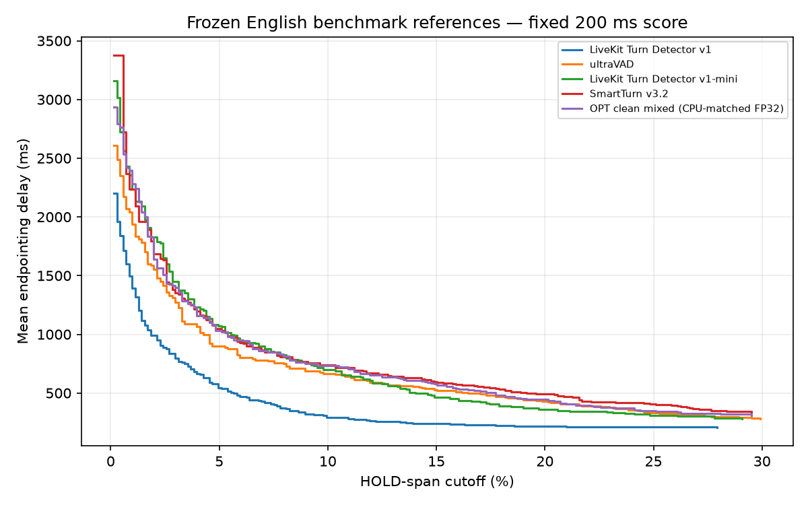
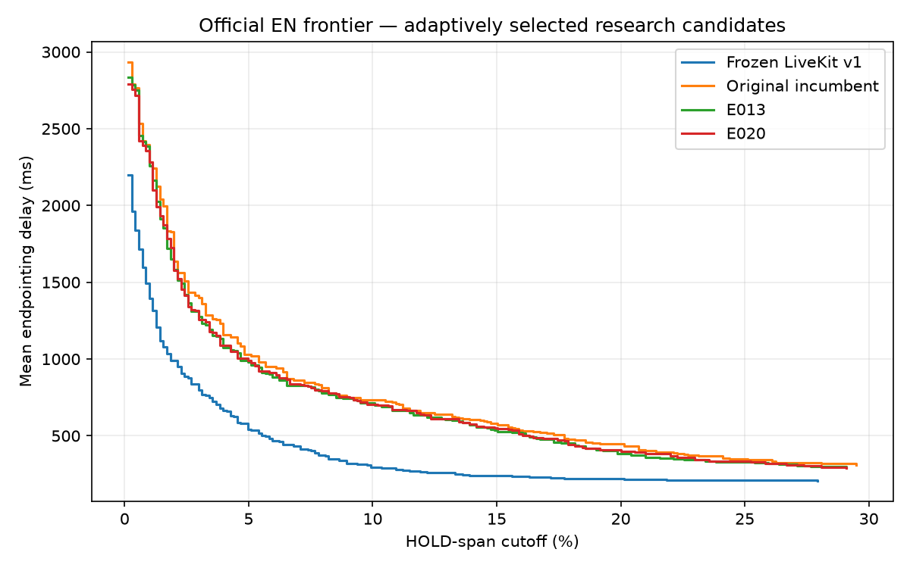
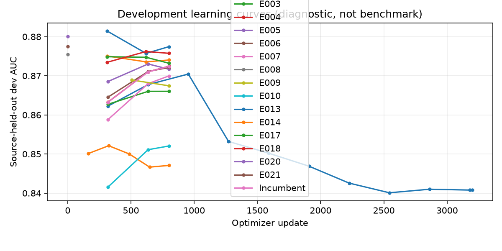

# Live research results

Incumbent: **OPT clean mixed (CPU-matched FP32)** (`H-1d657c44f3`), 1,031.5 ms endpointing delay at 5% cutoff; HTTP p95 **23.6 / 49.0 / 86.7 ms** at concurrency **1 / 4 / 8**. `incumbent.json` is the authoritative selection. No SOTA or production-readiness claim.

| Model | Delay @2% | Delay @5% | Delay @10% | Cutoff @300 ms | Cutoff @600 ms |
|---|---:|---:|---:|---:|---:|
| LiveKit Turn Detector v1 | 991.5 | 543.0 | 294.5 | 9.9 | 4.5 |
| ultraVAD | 1556.0 | 899.0 | 663.0 | 27.7 | 11.9 |
| LiveKit Turn Detector v1-mini | 1828.5 | 1070.5 | 697.5 | 27.8 | 12.1 |
| SmartTurn v3.2 | 1685.5 | 1050.7 | 739.0 | 35.2 | 14.8 |
| OPT clean mixed (CPU-matched FP32) | 1637.5 | 1031.5 | 731.5 | 30.5 | 14.5 |
| E013 (pareto-unpromoted) | 1582.0 | 979.5 | 715.0 | 27.7 | 13.5 |
| E020 (rejected) | 1576.0 | 992.5 | 705.0 | 28.1 | 13.5 |

Delays are milliseconds; cutoffs are percentages of eligible HOLD spans. Published LiveKit v1 scores are a reproducible artifact reference, not an independently rerun cloud-model result. English was already inspected; intervals and improvements remain adaptively selected.

## Iterations

| ID | State | Dev AUC | Decision | W&B |
|---|---|---:|---|---|
| D012 | audit-complete | — | Conservative rule and audit implemented; precision gain inconclusive until independent review. No training or incumbent promotion. | [run](https://wandb.ai/adrianbrunetto1-reshape/happyrobot-eot/runs/ar17624a05ae) |
| D015 | scaffold-complete | — | 15 synthetic semantic/parser tests pass; real-data validation remains required | [run](https://wandb.ai/adrianbrunetto1-reshape/happyrobot-eot/runs/ara84c4215f9) |
| D016 | pilot-complete | — | Pilot prepared and causal waveforms validated; semantic label accuracy awaits independent review. No otoSpeech model trained. | [run](https://wandb.ai/adrianbrunetto1-reshape/happyrobot-eot/runs/arf1f5aa876b) |
| D019 | pilot-complete | — | Pilot prepared and causal waveforms validated; semantic label accuracy awaits independent review. No otoSpeech model trained. | [run](https://wandb.ai/adrianbrunetto1-reshape/happyrobot-eot/runs/arbd404db9f3) |
| D022 | runtime-unavailable | — | GPU/HTTP trial not run; see P023 and partial D024 | pending |
| P023 | complete | — | CPU speech/silence wiring passed; no quality claim | pending |
| D024 | interrupted | — | User requested strategic reassessment; 34/48 calls saved, no relabeling or promotion | pending |
| E001 | rejected | 0.8704408425554429 | rejected at development gate; no benchmark accessed | [run](https://wandb.ai/adrianbrunetto1-reshape/happyrobot-eot/runs/13e9f0d0) |
| E002 | rejected | 0.8521201666593183 | rejected at development gate; no benchmark accessed | [run](https://wandb.ai/adrianbrunetto1-reshape/happyrobot-eot/runs/46004da7) |
| E003 | rejected | 0.8660263546580839 | rejected at development gate; no benchmark accessed | [run](https://wandb.ai/adrianbrunetto1-reshape/happyrobot-eot/runs/bf9b543a) |
| E004 | rejected | 0.8724290154755081 | rejected at development gate; no benchmark accessed | [run](https://wandb.ai/adrianbrunetto1-reshape/happyrobot-eot/runs/153b1875) |
| E005 | rejected | 0.873022849521626 | rejected at development gate; no benchmark accessed | [run](https://wandb.ai/adrianbrunetto1-reshape/happyrobot-eot/runs/c13d5a6d) |
| E006 | rejected | 0.8721272761342093 | rejected at development gate; no benchmark accessed | [run](https://wandb.ai/adrianbrunetto1-reshape/happyrobot-eot/runs/c8221d5b) |
| E007 | rejected | 0.8699572329262378 | rejected at development gate; no benchmark accessed | [run](https://wandb.ai/adrianbrunetto1-reshape/happyrobot-eot/runs/f90c56d3) |
| E008 | rejected | 0.8754698315770909 | rejected at development gate; no benchmark accessed | [run](https://wandb.ai/adrianbrunetto1-reshape/happyrobot-eot/runs/ar79485cfd15) |
| E009 | rejected | 0.8689293902385257 | rejected at development gate; no benchmark accessed | [run](https://wandb.ai/adrianbrunetto1-reshape/happyrobot-eot/runs/74e0c694) |
| E010 | rejected | 0.852048520788325 | rejected at development gate; no benchmark accessed | [run](https://wandb.ai/adrianbrunetto1-reshape/happyrobot-eot/runs/93c5f7fc) |
| E011 | deferred | — | User steered priority to data quality and otoSpeech; pretrained initialization preserved, training not started | [run](https://wandb.ai/adrianbrunetto1-reshape/happyrobot-eot/runs/ard446844c6f) |
| E013 | pareto-unpromoted | 0.881475684493629 | Quality and serving gains for seed17, but required seed42 development replication failed; preserve candidate as an unpromoted alternative and keep incumbent unchanged | [run](https://wandb.ai/adrianbrunetto1-reshape/happyrobot-eot/runs/0c2fa268) |
| E014 | rejected | 0.8750730236762048 | rejected at development gate; no benchmark accessed | [run](https://wandb.ai/adrianbrunetto1-reshape/happyrobot-eot/runs/af03ccde) |
| E017 | rejected | 0.8748746197257616 | rejected at development gate; no benchmark accessed | [run](https://wandb.ai/adrianbrunetto1-reshape/happyrobot-eot/runs/3981fb99) |
| E018 | rejected | 0.8762042017547728 | rejected at development gate; no benchmark accessed | [run](https://wandb.ai/adrianbrunetto1-reshape/happyrobot-eot/runs/d4b84c82) |
| E020 | rejected | 0.8801116573343327 | Rejected by predeclared quality gates; incumbent unchanged | [run](https://wandb.ai/adrianbrunetto1-reshape/happyrobot-eot/runs/ar81cbf6eae1) |
| E021 | control-complete | 0.8775172501212468 | Completed preregistered matched-control development comparison; no official benchmark required for this control | [run](https://wandb.ai/adrianbrunetto1-reshape/happyrobot-eot/runs/areeac1a227a) |
| H-058f84fc8f | historical | 0.9162340280234653 | historical evidence; see BACKLOG.md | [run](https://wandb.ai/adrianbrunetto1-reshape/happyrobot-eot/runs/hr9a4b470d6b) |
| H-1d657c44f3 | historical | 0.8723890591243773 | incumbent | [run](https://wandb.ai/adrianbrunetto1-reshape/happyrobot-eot/runs/hra6983dfacd) |
| H-407cd6ddd1 | historical | 0.8782664877520648 | historical evidence; see BACKLOG.md | [run](https://wandb.ai/adrianbrunetto1-reshape/happyrobot-eot/runs/hr992b59c6e1) |
| H-80f418aa6c | historical | 0.875635977704323 | historical evidence; see BACKLOG.md | [run](https://wandb.ai/adrianbrunetto1-reshape/happyrobot-eot/runs/hr279d289beb) |
| H-85778a7c3c | historical | 1.0 | historical evidence; see BACKLOG.md | [run](https://wandb.ai/adrianbrunetto1-reshape/happyrobot-eot/runs/hr87b1d177a1) |
| H-8f7d191f82 | historical | 0.9189409335121481 | historical evidence; see BACKLOG.md | [run](https://wandb.ai/adrianbrunetto1-reshape/happyrobot-eot/runs/hradda9fab9c) |
| H-98850eae17 | historical | 0.843922209868409 | historical evidence; see BACKLOG.md | [run](https://wandb.ai/adrianbrunetto1-reshape/happyrobot-eot/runs/hr805d17055e) |
| H-aa5fd4c3b2 | historical | 0.8005136431395424 | historical evidence; see BACKLOG.md | [run](https://wandb.ai/adrianbrunetto1-reshape/happyrobot-eot/runs/hrecc5a6a7e8) |
| H-b5d8b79296 | historical | 0.8723890591243773 | historical evidence; see BACKLOG.md | [run](https://wandb.ai/adrianbrunetto1-reshape/happyrobot-eot/runs/hr5c1572beb5) |
| H-d1d22ff208 | historical | 0.902110044761399 | historical evidence; see BACKLOG.md | [run](https://wandb.ai/adrianbrunetto1-reshape/happyrobot-eot/runs/hr6d6737be6a) |
| H-e2851249af | historical | 0.7636012811372523 | historical evidence; see BACKLOG.md | [run](https://wandb.ai/adrianbrunetto1-reshape/happyrobot-eot/runs/hr26b6f7bf34) |
| H-f8fde8cf27 | historical | 0.7987726231787713 | historical evidence; see BACKLOG.md | [run](https://wandb.ai/adrianbrunetto1-reshape/happyrobot-eot/runs/hr2a1334cc27) |
| P010 | complete | — | Both 2s and 4s base architectures meet workload; use 4s for more context. Random weights: no quality conclusion. | [run](https://wandb.ai/adrianbrunetto1-reshape/happyrobot-eot/runs/ar229921285c) |

Resume from [README](README.md), [bitácora](BITACORA.md), [backlog](BACKLOG.md) and the exact commands in `experiments/<id>.json`. Model weights/checkpoints remain local. W&B tracks metrics, small tables and plots only.

Current search decision: paused for the user-requested [strategic review](STRATEGY_REVIEW.md). D024 is partial; no new training or official benchmark run.
